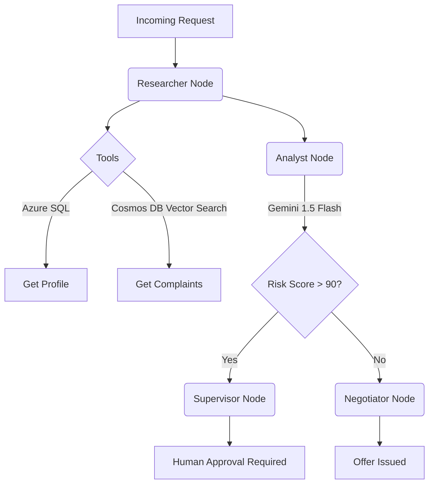

<div align="center">
  <h1>🤖 Multi-Agent Customer Retention System (v2)</h1>
  <p><i>An enterprise-grade, agentic AI system built with LangGraph, Google Gemini, and Microsoft Azure.</i></p>

  
  
  
  
  
</div>

---

## 🌟 Overview

This project is a sophisticated **Customer Retention AI System**. Instead of relying on a rigid, linear pipeline, it uses an **Agentic Workflow** powered by `LangGraph`. Multiple specialized AI agents (Researcher, Analyst, Negotiator, Supervisor) collaborate, use tools, and make dynamic decisions to identify flight-risk customers and formulate retention strategies.

The system is fully backed by **Microsoft Azure**, utilizing Serverless Cosmos DB for vector search, Azure SQL for relational data, and Azure Container Apps for deployment.

---

## 🧠 The Agentic Workflow

How does the AI actually think and act? We built a state machine where different "Node" agents communicate by passing a shared `AgentState` back and forth.



1. **Researcher**: Receives the Customer ID and uses native Gemini Tool-Calling to dynamically query the Azure SQL database (for billing info) and Cosmos DB (for semantic vector searches of past complaints).
2. **Analyst**: Reviews the gathered data and uses structured Pydantic outputs to calculate a strict `risk_score` (0-100) and provide a detailed reasoning paragraph.
3. **Router**: A conditional edge evaluates the score. High-risk customers are escalated to the Supervisor; standard-risk customers are sent to the Negotiator.

---

## 📂 Project Structure & Codebase Deep-Dive

Every file in this repository has a specific, production-ready purpose.

```text
multi-agent-azure-v2/
├── app/                        # Main FastAPI Application
│   ├── agent/                  # The LangGraph AI Brain
│   │   ├── graph.py            # Defines the edges, nodes, and conditional routing of the agents.
│   │   ├── nodes.py            # Contains the logic for the Researcher, Analyst, Supervisor, etc.
│   │   ├── state.py            # Pydantic schemas that define the memory/state passed between agents.
│   │   └── tools.py            # The actual Python functions the AI can call (SQL/Cosmos queries).
│   ├── clients/                # Cloud Infrastructure Wrappers
│   │   ├── blob.py             # Azure Blob Storage client (for PDF storage).
│   │   ├── cosmos.py           # Azure Cosmos DB client (for Vector Search).
│   │   ├── gemini.py           # Google GenAI SDK client (using gemini-1.5-flash-latest).
│   │   └── sql.py              # PyODBC client for connecting to Azure SQL.
│   ├── config.py               # Centralized environment variable loading (pydantic-settings).
│   ├── logging_config.py       # OpenTelemetry setup streaming logs directly to Azure App Insights.
│   └── main.py                 # The FastAPI entry point (handles routing, API keys, rate limiting).
├── scripts/                    # Data Engineering & Utilities
│   ├── build_memory.py         # Downloads PDFs, creates Gemini embeddings, and indexes in Cosmos DB.
│   ├── generate_data.py        # Generates synthetic customers, writes PDF complaints, uploads to SQL/Blob.
│   └── list_models.py          # Utility script to check available Gemini models on your API key.
├── tests/                      # Unit and Integration Tests (Pytest)
├── .github/workflows/          
│   └── deploy.yml              # CI/CD pipeline to deploy the Docker container to Azure Container Apps.
├── .env.example                # Template for your Azure/Gemini secrets.
├── Dockerfile                  # Multi-stage Dockerfile for cloud deployment.
└── requirements.txt            # Python dependencies.
```

---

## 🛠️ How We Built This (The Technical Highlights)

- **Structured LLM Outputs:** We avoided fragile string parsing. By using `response_schema` in the Gemini SDK, the Analyst node is forced to return a perfect JSON object that matches our `RiskAssessment` Pydantic class.
- **True Tool Calling:** The Researcher node doesn't just prompt the LLM; it provides a list of Python functions (tools). The LLM autonomously decides *which* tool to call and with *what* arguments to fetch the data it needs.
- **Enterprise Observability:** We integrated `azure-monitor-opentelemetry-exporter` so that every request, error, and agent thought process is logged and queryable in Azure Log Analytics.

---

## 🚀 Getting Started

To run this project locally, you must first provision the Azure infrastructure.

### 1. Azure Setup
Create the necessary resources using the Azure CLI. *(Note: This project is optimized for student budgets using Serverless and Basic tiers).*
You will need:
- Resource Group
- Azure SQL Database (Basic Tier)
- Azure Cosmos DB (Serverless, Vector Search Enabled)
- Azure Blob Storage (Standard LRS)
- Application Insights

### 2. Environment Configuration
Copy the `.env.example` file to `.env` and fill in your keys.
```bash
cp .env.example .env
```

### 3. Install Dependencies
Ensure you have the Microsoft ODBC Driver 18 installed on your OS, then run:
```bash
pip install -r requirements.txt
```

### 4. Data Engineering
Generate the synthetic database and build the vector memory:
```bash
python scripts/generate_data.py
python scripts/build_memory.py
```

### 5. Run the Server
Start the FastAPI server:
```bash
uvicorn app.main:app --host 0.0.0.0 --port 8000 --reload
```

---

## 🎯 Testing the API

Once the server is running, you can interact with the agent via the terminal:

```bash
curl -X POST "http://localhost:8000/analyze_customer" \
     -H "Content-Type: application/json" \
     -H "X-API-Key: super-secret-key-123" \
     -d '{"customer_id": "3668-QPYBK"}'
```

**Expected Response:**
```json
{
  "status": "success",
  "customer_id": "3668-QPYBK",
  "analysis": {
    "risk_score": 92,
    "reasoning": "The customer has an extremely high churn risk due to a combination of very low tenure (2 months) and severe, work-disrupting technical issues with their Fiber optic service...",
    "confidence": "high"
  },
  "decision": {
    "offer": "PENDING_SUPERVISOR_APPROVAL",
    "requires_human_approval": true
  },
  "retries": null
}
```

---
<div align="center">
  <i>Built with ❤️ using LangGraph, Gemini, and Azure</i>
</div>
